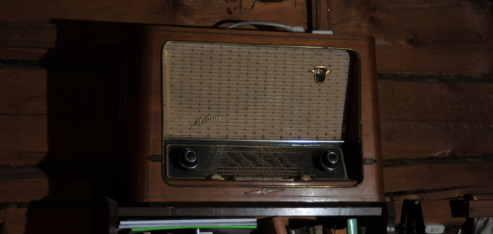

# Vanhaan radioon uutta toiminnallisuutta

Projektissa vanhaan 50-luvun radioon (Salora Milano) on asennettu raspberry pi, jolla voi soittaa mp3 tiedostoja (esim. YLE arkston vanoja radio-ohjelmia tai muuta mp3 musiikkia). Sillä voi myös striimata interenradiokanavia. 

Radion "kanavina" toimivat albummit. Kanavaa voi vaihtaa vanhalla kanavalitsemlla, johon on liitetty magneetit+magneettianturit jotka rekisteröivät kanavavalitsemen pyörityksen. Äänenvoimakkuus nappi on toteuttu Wemos D1 mini (ESP8266) mikrokontrollelilla, joka ottaa analogista signaalia sisään. Atamega sylkee ulos äänenvoimakkuusdataa sarjaportin kautta raspikselle.

Rasperry toimii myös www-serverinä, jonka kautta soitettavia tiedostoja/albumeja voi valita sekä säätää äänenvoimakkuutta.

Radio lähettää myös tiedot soitettavasta kappaleesta omalle serverille, joka jakaa sitä mm. atmge328+nokia5110 näyttö yhdistelmään. 

## Rakenne

### Raspis

Raspiksella pyörii kolme demonia: musiikki, volume ja viesti. Lisäksi on php scripti joka ottaa selaimelta vastaan käskyt soittaa kappale tai lista, tai muuttaa äänenvoimakkuutta. Veistintä php:n ja muusiikkidemoninen kanssa hoidetaan luomalla viestitieodsto, jonka olemassaoloa demoni tarkkailee, lukee ja tuhoaa.

- Musiikki vastaa muiden nappien kuin volumanpin kuuntelusta, kappaleiden valinnasta ja käskystä soittaa. Itse kappaleen soitto tapahtuu mpg123 ohjelmalla. Alussa musiikki forkkaa tämän omaksi prosessikseen taustalle.
- Volume saada serialin kautta viestejä MCU:lta. Se tulkitsee ne ja säätää äänenvoimakkuudet
- Viesti lähettää tiedon soitettavasta kappaleesta serverille. Välitys tapahtuu siten, että musiikki luo tiedoston jota demoni tarkkailee, lukee ja poistaa

Html serveri on teottu html + css + js(frontend) + php(backend) kuviolla.

Lisäksi raspiksella on albums_to_json.py -ohjelma, jolla luodaan tarvittavat json ja muut aputiedoston albumirakenteesta. Albumit laitetaan omiksi kansioiksi 

### MCU

Tässä on simppeli koodi joka lukee analogisisäntuloa ja jos on muutosta niin lähettä arvon (0-1000) serialilla ulos.

